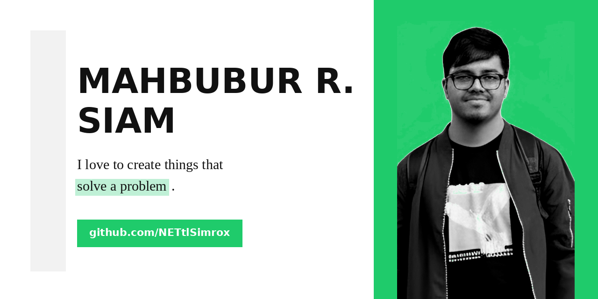

<div align="center">



```
$ whoami
```

<h1>Siam <sub>/see-aam/</sub></h1>


</div>

<br>

## `boot_log.sh`

```bash
[  0.001729 ] initializing Siam...
[  0.014203 ] role         : CS & Business student
[  0.032881 ] based_in     : Wayne State College
[  0.045502 ] currently    : exploring robotics + software 🤖
[  0.061240 ] learning     : always leveling up in Python & C
[  0.078993 ] fun_fact     : built a robot project back in school
[  0.099102 ] status       : ONLINE ✅
```

<br>

## `stack.json`

<div align="center">


</div>


<br>

## `git log --stats`
<div align="center">  </div> <br>

## `contact --request-handshake`

<div align="center">

[](https://linkedin.com/in/[your-handle])
[](mailto:you@example.com)

</div>

<br>

<div align="center">

```
$ echo "thanks for stopping by — now go build something."
```


</div>
